# PAXI + RC Link 建模行为分析

> 本文档从仿真建模的角度, 系统梳理 PAXI (事务层) 和 RC Link (传输层) 的传输流程、Buffer 资源、重传机制和流控行为。
>
> 基于: PAXI SUE2.0 Core UserGuide V2R0P5, RCLINK AFH SPEC v2.4

---

## 1. 术语表 (Glossary)

### 1.1 协议栈与架构

| 术语 | 全称 | 定义 |
|------|------|------|
| **PAXI** | Protocol of Accelerated eXchange Interconnect | 事务层, 将 AXI 总线事务映射到以太网链路 |
| **RC Link** | Reliable Connection Link | 传输层, 提供可靠传输 (Go-Back-N)、流控 (CBFC)、速率控制 |
| **CESOC** | - | 以太网控制器子系统 (MAC + PCS + FEC) |
| **Flit** | Flow Control Unit | PAXI 基本传输单元 |

### 1.2 寻址与通道

| 术语 | 全称 | 定义 |
|------|------|------|
| **DA/SA** | Destination/Source Address | 目标/源芯片标识符 |
| **VC** | Virtual Channel | 虚拟通道, 支持 8 个独立 VC (VC0~VC7) |
| **QP** | Queue Pair | RC Link 基本通信端点, 最多 1024 个 |
| **Bank** | - | TYPE1 REQ 按 QPID 低位分为最多 4 个 Bank, 用于独立流控和轮转仲裁 |

### 1.3 传输与可靠性

| 术语 | 全称 | 定义 |
|------|------|------|
| **PSN** | Packet Sequence Number | 数据包序列号 (12-bit), 用于 Go-Back-N 顺序检测 |
| **OST** | Outstanding | 已发出但未收到确认的请求数量 |
| **Go-Back-N** | - | 重传算法: 检测到 PSN 错误时, 从错误点重发所有后续包 |
| **ACK/NAK** | Acknowledge / Negative Acknowledge | 确认/否定确认报文 |
| **FACK** | Forced ACK | 强制 ACK, 要求对端尽快回复 (延迟敏感场景) |
| **CNP** | Congestion Notification Packet | 拥塞通知报文, 检测到 ECN 标记时生成 |
| **ECN** | Explicit Congestion Notification | 显式拥塞通知 |

### 1.4 流量控制

| 术语 | 全称 | 定义 |
|------|------|------|
| **CBFC** | Credit-Based Flow Control | 端到端流控, 发送方跟踪接收方可用 Credit, 不足时阻塞 |
| **PFC** | Priority Flow Control | 优先级流控, 基于 RX Buffer 水位线触发暂停帧 |
| **Credit** | - | 信用单元, 代表接收方的可用缓冲空间 |
| **Watermark** | - | 水位线, RX Buffer 的高/低阈值, 用于触发/解除背压 |

### 1.5 数据类型

| 术语 | 定义 |
|------|------|
| **TYPE1** | 可靠单播, 支持 Go-Back-N E2E 重传, 512 OST |
| **TYPE2** | 不可靠多播, 无重传, 16 OST |
| **TYPE3** | 原始以太网报文 |
| **REQ** | AXI 请求方向 Flit (AW+W, AR) |
| **RSP** | AXI 响应方向 Flit (R, B) |
| **MUL** | 多播 Flit |

### 1.6 报文格式

| 格式 | 报头开销 (无VLAN) | 特征 |
|------|-------------------|------|
| **Standard** | 50B | 完整 MAC/IP/UDP/RH, 支持 ECN |
| **AFH_GEN1** | 22B | 自定义 MAC 头, 可选 TC 域 |
| **AFH_GEN2_16b** | 22B | 16-bit 地址压缩 |
| **AFH_Lite** | 12B | 最简, 无 VLAN/ECN, 无 E2E 重传 |

---

## 2. 完整传输流程

### 2.1 单播写请求 (AXI Write) 端到端流程

这是最典型的传输路径, 涵盖从 AXI Master 发起写事务到远端完成写操作并返回 B 响应的全过程。

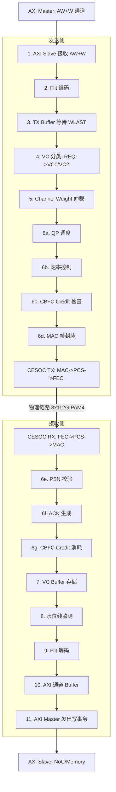

**B 响应返回路径** (反向, RSP 通道):

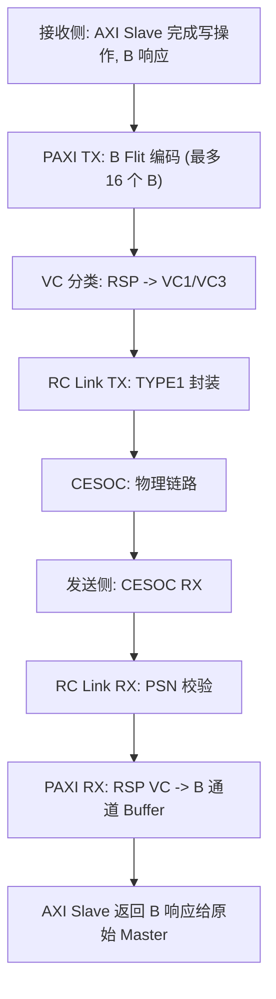

### 2.2 单播读请求 (AXI Read) 端到端流程

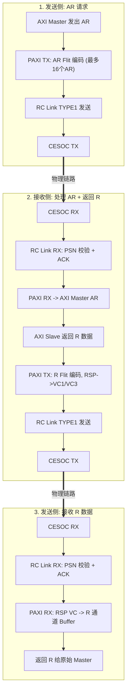

**关键差异**: R 通道支持 interleaving, PAXI 为每个 OST 读请求分配独立 Buffer 空间, 按 Buffer 填满的顺序发送 (非严格 FIFO)。

### 2.3 多播写请求流程

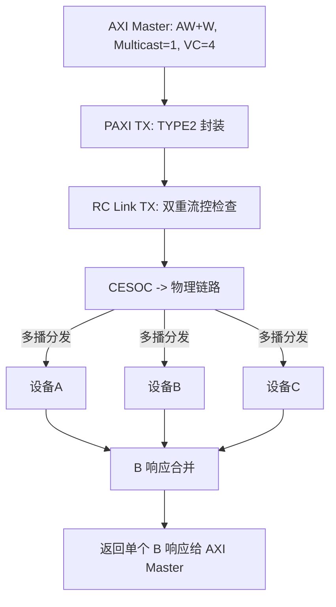

**多播细节**:
- RC Link TX 双重流控: (1) CBFC VC4 Credit (2) 多播专用 Credit
- B 响应合并: 全部 OK -> OKAY, 任一错误 -> ERROR, 超时 -> MULTI-CAST TIMEOUT

**建模要点**:

- TYPE2 无 Go-Back-N 重传, 可靠性依赖 FEC
- B 响应延迟 = max(所有组内设备的响应延迟)
- 超时阈值: 默认 ~64M cycles

### 2.4 传输流程中的关键延迟分解

从建模角度, 端到端延迟可分解为以下阶段:

```
T_total = T_paxi_tx + T_rclink_tx + T_cesoc_tx + T_link + T_cesoc_rx + T_rclink_rx + T_paxi_rx

其中:
  T_paxi_tx:
    - Flit 编码延迟 (固定, 几个时钟周期)
    - TX Buffer 等待 (AW+W: 等 WLAST; AR/B: 等水位/超时/DA切换)
    - VC 仲裁等待 (取决于 Channel Weight 和通道竞争)

  T_rclink_tx:
    - QP 调度等待 (Slot FIFO 排队, Bank 轮转)
    - 速率控制等待 (acc_cnt >= length_thr 时被阻塞到下一时间窗口)
    - CBFC Credit 等待 (Credit 不足时阻塞直到接收方返还)
    - MAC 帧封装 (报头开销取决于格式: Standard > AFH_GEN1 > AFH_GEN2 > AFH_Lite)

  T_cesoc_tx:
    - MAC 处理 + PCS 编码 + FEC 编码 (固定流水线延迟)

  T_link:
    - SerDes 传播延迟 + 物理介质延迟
    - 若经过 L2 Switch: 额外交换延迟

  T_cesoc_rx:
    - FEC 解码 + PCS 解码 + MAC 处理 (固定流水线延迟)

  T_rclink_rx:
    - PSN 校验 (固定)
    - ACK 生成和发送 (ACK MERGE 可能引入少量延迟)

  T_paxi_rx:
    - VC Buffer 写入 (固定)
    - Flit 解码 (固定)
    - AXI 通道 Buffer 排队 (取决于下游 AXI 背压)
```

**最低延迟**: 150ns AXI-to-AXI @ 400G (C2C 直连, 无竞争)

---

## 3. Buffer 资源全景

### 3.1 PAXI TX 方向 (4 个 Buffer)

| Buffer         | 容量           | 触发发出条件                                                                | 建模影响                                               |
| -------------- | -------------- | --------------------------------------------------------------------------- | ------------------------------------------------------ |
| **AW+W** | 1 个 MPS burst | 收到 AW 请求 + 当前 burst 的 WLAST                                          | 写延迟受 burst 长度影响: 必须收齐整个 burst 才发出     |
| **R**    | OST 个空间     | 按 Buffer 填满顺序发出                                                      | 支持 interleaving; 多个并发读的 R 数据可交叉返回       |
| **AR**   | 深度 16        | (1) 达到 TX_BUF_WM 水位`<br>`(2) DA/VC 切换`<br>`(3) TX_BUF_ACC_WT 超时 | 打包优化: 最多 16 个 AR 合并为 1 个 Flit, 减少帧头开销 |
| **B**    | 深度 16        | 同 AR                                                                       | 打包优化: 最多 16 个 B 合并为 1 个 Flit                |

**AR/B 打包行为详解**:

- 三个触发条件中任一满足即发出
- 打包后帧长不能超过最大帧长 (由 Ethernet Frame Length Register 配置)
- DA 或 VC 发生切换时, 强制发出之前累积的数据 (不同目标不能混在同一 Flit)

### 3.2 PAXI RX 方向 (8 个 Buffer)

#### VC Buffer (3 个)

| Buffer            | 总容量        | 默认高水位    | 预留吸收空间 | 触发背压                    |
| ----------------- | ------------- | ------------- | ------------ | --------------------------- |
| **REQ MEM** | 32 帧 + 2 RTT | 32 帧 + 1 RTT | 1 RTT        | 超过高水位 -> PFC/CBFC 背压 |
| **RSP MEM** | 32 帧 + 2 RTT | 32 帧 + 1 RTT | 1 RTT        | 同上                        |
| **MUL MEM** | 8 帧 + 2 RTT  | 8 帧 + 1 RTT  | 1 RTT        | 同上                        |

**水位线行为**:

```
                   Buffer 容量
                   |<-------------- 32帧 + 2RTT ------------->|
                   |                                           |
写入位置 --------->|===数据===|===数据===|====空闲====|==预留==|
                   |                    ^             ^        |
                   |              低水位(1RTT)  高水位(32帧+1RTT)
                   |
触发逻辑:
  数据量 > 高水位 -> 触发背压 (PFC帧 或 CBFC Credit耗尽)
  数据量 < 低水位 -> 解除背压
  预留的 1 RTT 空间: 吸收背压生效前仍在链路上传输的数据
```

#### AXI 通道 Buffer (5 个)

| Buffer              | 容量   | 说明       |
| ------------------- | ------ | ---------- |
| **AW Buffer** | 16 MPS | 写地址通道 |
| **W Buffer**  | 16 MPS | 写数据通道 |
| **B Buffer**  | 16 MPS | 写响应通道 |
| **AR Buffer** | 16 MPS | 读地址通道 |
| **R Buffer**  | 16 MPS | 读数据通道 |

每个通道独立握手, 即使某通道被 AXI 背压, 其他通道仍可正常接收。

### 3.3 RC Link 资源

| 资源                   | TYPE1 (可靠单播)     | TYPE2 (不可靠多播) | TYPE3 (原始以太网)   |
| ---------------------- | -------------------- | ------------------ | -------------------- |
| **Outstanding**  | 512                  | 16                 | N/A                  |
| **最大 Payload** | 1344 字节            | 1344 字节          | TX: 4096B, RX: 8192B |
| **QP 数量**      | 最多 1024            | N/A                | N/A                  |
| **VC 通道**      | 4 (4 Bank)           | 1                  | 1                    |
| **重传 Buffer**  | 512 Slot (Go-Back-N) | 无                 | 无                   |
| **ACK Buffer**   | 2^QP_AW (ACK MERGE)  | N/A                | N/A                  |
| **CNP Buffer**   | 深度 8 (CNP MERGE)   | N/A                | N/A                  |
| **初始 Credit**  | 由 CBFC 配置         | 2048               | 由 CBFC 配置         |

### 3.4 Buffer 资源总结图

**TX 路径:**

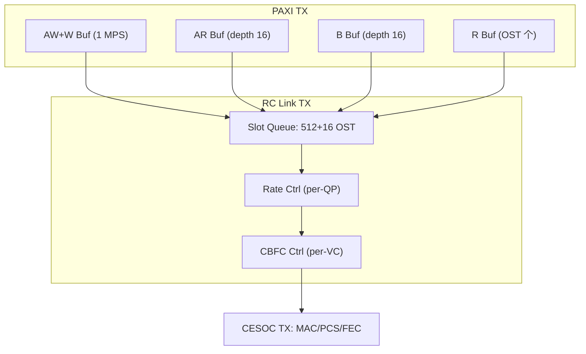

**RX 路径:**

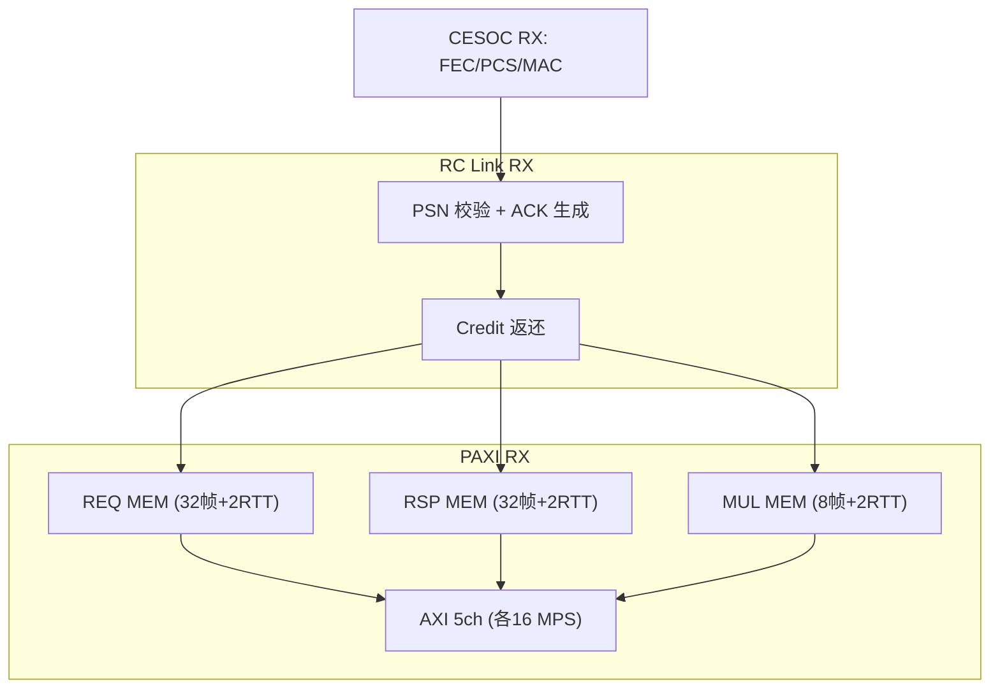

---

## 4. 重传机制 (Retry)

### 4.1 三层错误保护体系

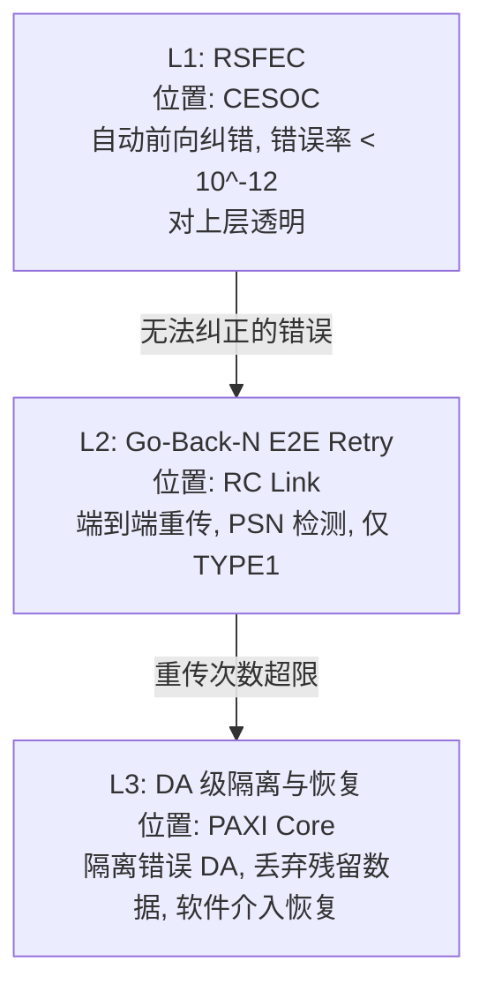

### 4.2 L2: Go-Back-N E2E 重传详解

**触发条件**: 接收方检测到 PSN 不连续 (丢包或乱序)

**重传行为**:

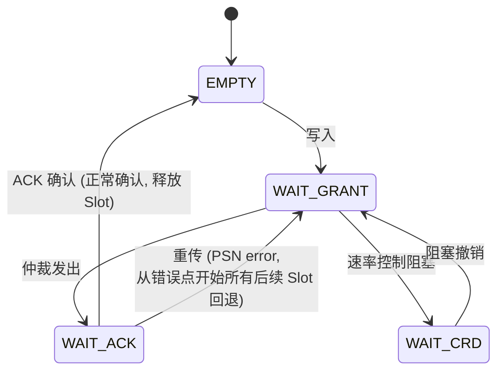

**Go-Back-N 行为**:

- 接收方发现 PSN 缺口时, 发送 NAK (Opcode=01, NAK flag)
- 发送方收到 NAK 后, 将该 QP 所有 WAIT_ACK 状态的 Slot 回退到 WAIT_GRANT
- 从最早未确认的包开始重新发送
- 重传计数器递增, 超过阈值 (RETRY_TIMER_CFG) 则上报中断

**ACK MERGE 机制**:

```
目的: 减少 ACK 报文数量, 提高效率

Buffer: 深度 2^QP_AW 的位图寄存器
  - 收到需要 ACK 的包: Buffer[QPID] = 1
  - ACK 发出后: Buffer[QPID] = 0

轮询: 以 4 组为单位依次检查
  - Pointer 指向的 QPID Buffer 位为 1 -> 发出该 QPID 的 ACK
  - 4 组轮询确保多 QP 间的公平性
```

**FACK (Forced ACK)**:

- 发送方在报文 RH 中设置 FACK=1
- 接收方收到后尽快回复 ACK, 不等待 ACK MERGE 合并
- 用于延迟敏感的事务

**建模参数**:

| 参数           | 值                       | 影响                   |
| -------------- | ------------------------ | ---------------------- |
| PSN 宽度       | 12-bit (0~4095)          | PSN 回绕周期           |
| 最大 OST       | 512 (TYPE1)              | 发送窗口大小, 影响吞吐 |
| 最大 QP        | 1024                     | 并发连接数             |
| 最大 Payload   | 1344 字节                | 单包数据量             |
| 重传阈值       | 可配置 (RETRY_TIMER_CFG) | 超限后进入 fatal 状态  |
| ACK MERGE 轮询 | 4 组/轮                  | ACK 延迟               |

### 4.3 L3: PAXI DA 级错误恢复

当 RC Link 重传超限时, PAXI 执行 DA 级隔离:

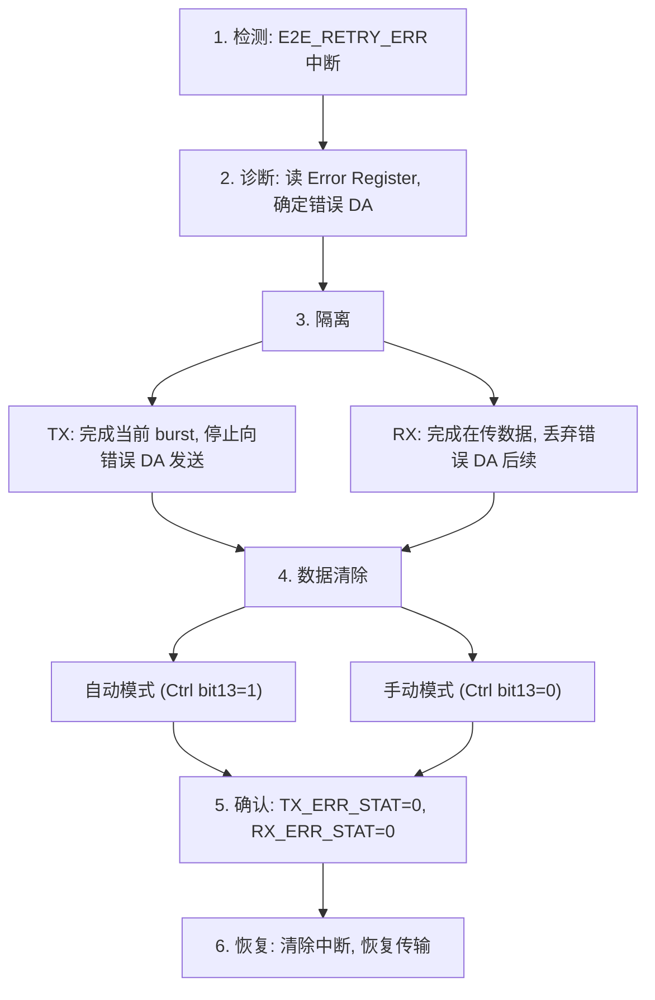

### 4.4 RC Link QP Fatal 处理 (重传超限后)

当某个 QP 重传次数达到阈值, 需要完整的 QP 重建:

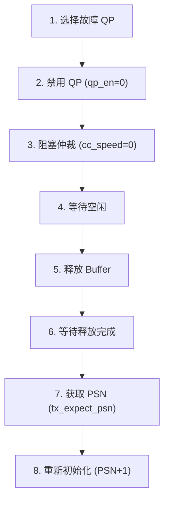

---

## 5. 流控机制

### 5.1 流控体系全景

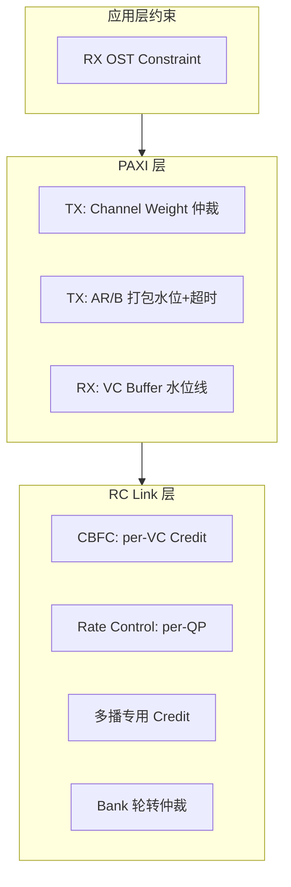

### 5.2 CBFC 详细行为

CBFC 是 SUE2.0 主要的端到端流控机制。

**初始化**:

```
MAC 通过 MAC2TX_CBFC_RST_I[31:0] 配置各 VC:
  - 低 8bit: 指示哪些 VC 需初始化 (可同时或逐个)
  - 配置内容: credit_size, credit_limit (CL), pkt_ovhd
  - 建议在 RC Link 工作前完成
```

**稳态工作**:

```
发送方                                    接收方
========                                  ========
维护 per-VC 剩余 Credit 计数              维护 per-VC 本地 Credit 计数

发包时:                                   收包时:
  consumed = ceil(pkt_len / credit_size)    consumed = ceil(pkt_len / credit_size)
  remaining_credit -= consumed              local_credit -= consumed

  if remaining_credit < credit_uf_limit:    数据从 Buffer 弹出时:
    阻塞该 VC, 不参与仲裁                     归还 Credit
                                              通过 MAC2TX_CBFC_VLD_I 同步给发送方

                                            发送方收到 Credit 返还:
                                              remaining_credit += returned_credits
                                              if remaining_credit >= credit_uf_limit:
                                                解除 VC 阻塞
```

**VC 到物理流量映射**:

```
7 路物理流量 <-> 8 个 VC (一一映射, 不可共享)

TYPE1_REQ Bank0 (QPID[1:0]=00) -> type1_req_bank0_cbfc[2:0] -> VCx
TYPE1_REQ Bank1 (QPID[1:0]=01) -> type1_req_bank1_cbfc[2:0] -> VCy
TYPE1_REQ Bank2 (QPID[1:0]=10) -> type1_req_bank2_cbfc[2:0] -> VCz
TYPE1_REQ Bank3 (QPID[1:0]=11) -> type1_req_bank3_cbfc[2:0] -> VCw
TYPE1_ACK + CNP                 -> type1_ack_cbfc[2:0]       -> VCa
TYPE2                           -> type2_cbfc[2:0]            -> VCb
TYPE3                           -> type3_cbfc[2:0]            -> VCc
```

**高级特性**:

| 特性                                              | 行为                                              | 适用范围     |
| ------------------------------------------------- | ------------------------------------------------- | ------------ |
| **动态下限** (dyn_uf_limit_cbfc_en)         | Credit 低于水线但仍大于最大包长时, 允许再发一个包 | 仅 TYPE1 REQ |
| **软件流控** (software_ctrl_cbfc_vc_status) | 对应 VC 位=0: 强制停止; 位=1: 允许                | 所有 VC      |
| **全局禁用** (stop_cbfc_en)                 | 最高优先级, 禁用所有 CBFC                         | 全局         |

### 5.3 PFC 行为 (CBFC 的替代方案)

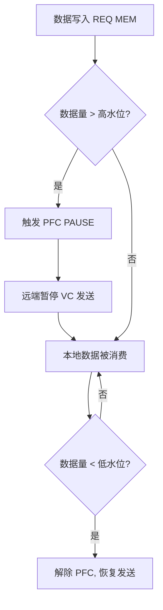

**注意**: 即使使用 CBFC 模式, RX 方向的反压信号 TX_PFC_REQ_O[7:0] 仍被复用 (CBFC 和 PFC 共用该接口)。

### 5.4 Per-QP 速率控制

```
目的: 控制每个 QP 的发送带宽, 防止单个 QP 独占链路

机制: 时间窗口 + 字节累加器

配置:
  CC_WINDOW: 时间窗口大小 (4.096 / 8.192 / 16.384 / 32.768 / 65.536 us)
  length_thr: 每个窗口内允许发送的最大字节数 (per-QP 配置)

工作流程:
  每个 QP 维护 acc_cnt (累加计数器):
    - WQE 发送时: acc_cnt += wqe_data_size
    - 窗口复位时: acc_cnt = max(acc_cnt - length_thr, 0)   // 跨窗口欠账带入下一窗口
    - acc_cnt >= length_thr: 置位 ARB_REQ_MASK, 阻塞该 QP
    - acc_cnt < length_thr:  清零 ARB_REQ_MASK, 允许该 QP

示例 (length_thr = 0x30):
  窗口1: 发包0x10 -> acc=0x10 (OK)
         发包0x30 -> acc=0x40 (>0x30, 阻塞)
  窗口2复位: acc=max(0x40-0x30,0)=0x10 (解除阻塞)
         发包0x20 -> acc=0x30 (>=0x30, 阻塞)
  窗口3复位: acc=max(0x30-0x30,0)=0x00 (解除阻塞)
```

**TYPE2 也支持独立速率控制**, 通过 SET_TYPE2_RATE_VLD_I 接口设置。

**反馈信号给上游**:

- CC_TYPE1_QP_EN_SET_O / CC_TYPE1_QP_EN_CLR_O: 通知上游 PAXI 某 QP 是否可发送
- 防止上游在 QP 被限速时持续灌入数据, 导致 RC Link 内部 Buffer 被占满而阻塞其他 QP

### 5.5 TYPE1 发送仲裁

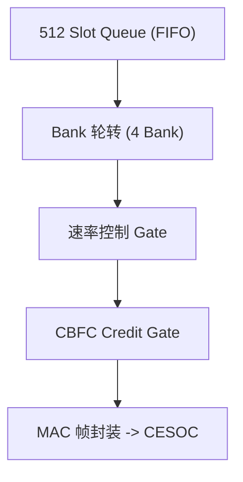

- **Bank 轮转**: 按 QPID[1:0] 分 4 Bank, 发出一个 Bank 后优先调度其他 Bank
- **速率控制**: acc_cnt >= length_thr 时阻塞 (WAIT_CRD)
- **CBFC Gate**: remaining_credit < credit_uf_limit 时阻塞该 VC

### 5.6 CNP MERGE (拥塞通知过滤)

```
目的: 防止拥塞时 CNP 风暴导致过度降速

机制:
  QPID_Buffer: 深度 8, 记录最近处理过的 QPID
  TIMER_Buffer: 记录每个 QPID 的最近处理时间

  收到 CNP 报文:
    if QPID 不在 QPID_Buffer:
      -> 透传 (首次)
    if QPID 在 QPID_Buffer:
      时间差 = 当前时间 - TIMER_Buffer[QPID].qpid_time
      if 时间差 <= TIMER_THR_I:
        -> 过滤 (短时间内重复的 CNP)
      if 时间差 > TIMER_THR_I:
        -> 透传 (足够间隔后的新 CNP)
```

### 5.7 多播双重流控

TYPE2 多播报文需同时满足两层流控:

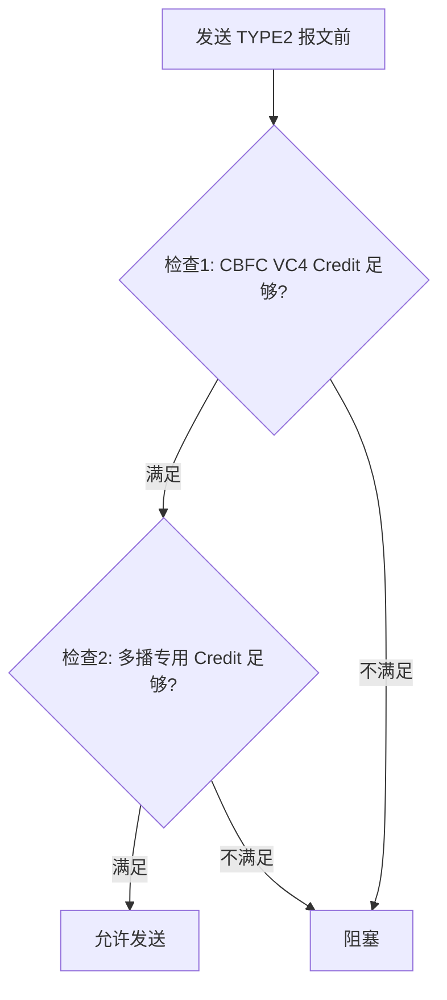

---

## 6. 建模关键参数汇总

### 6.1 性能相关参数

| 参数               | 默认/典型值         | 影响                       |
| ------------------ | ------------------- | -------------------------- |
| MAC 带宽           | 400G / 200G         | 链路峰值吞吐               |
| AXI-to-AXI 延迟    | 150ns @ 400G (C2C)  | 最低端到端延迟基准         |
| TYPE1 最大 Payload | 1344 字节           | 单包有效数据量, 影响帧效率 |
| TYPE1 OST          | 512                 | 发送窗口, 影响流水线吞吐   |
| TYPE2 OST          | 16                  | 多播并发度                 |
| QP 数量            | 1024                | 并发通信端点数             |
| VC 数量            | 8                   | 流量隔离通道数             |
| Bank 数量          | 4 (TYPE1 REQ)       | REQ 仲裁公平性粒度         |
| 时钟频率           | 最大 1GHz (RC Link) | 处理吞吐上限               |

### 6.2 Buffer 容量参数

| 参数             | 值            | 公式/说明                 |
| ---------------- | ------------- | ------------------------- |
| REQ/RSP MEM      | 32 帧 + 2 RTT | RTT 取决于链路配置        |
| MUL MEM          | 8 帧 + 2 RTT  | 多播 Buffer 较小          |
| 高水位默认       | N 帧 + 1 RTT  | N=32 (REQ/RSP) 或 8 (MUL) |
| AXI 通道 Buffer  | 16 MPS/通道   | 5 个独立通道              |
| AR/B TX 打包深度 | 16            | 最多 16 事务合并          |
| TX_BUF_WM        | 可配置        | AR/B 打包水位             |
| TX_BUF_ACC_WT    | 可配置        | AR/B 打包超时             |

### 6.3 流控参数

| 参数                   | 范围                         | 说明                   |
| ---------------------- | ---------------------------- | ---------------------- |
| credit_size            | 32/64/128/256/1024/2048 字节 | Credit 粒度            |
| credit_limit (CL)      | 可配置                       | per-VC 最大 Credit 数  |
| credit_uf_limit        | 1~7                          | Credit 下限 (禁止配 0) |
| CC_WINDOW              | 4.096~65.536 us              | 速率控制时间窗口       |
| length_thr             | per-QP 配置                  | 每窗口最大发送字节数   |
| Channel Weight REQ/RSP | 默认 0x0008                  | 通道仲裁权重           |
| Channel Weight MUL     | 默认 0x0100                  | 多播权重 (较高)        |

### 6.4 重传参数

| 参数               | 值                       | 说明              |
| ------------------ | ------------------------ | ----------------- |
| PSN 宽度           | 12-bit                   | 序列号空间 0~4095 |
| 重传次数阈值       | 可配置 (RETRY_TIMER_CFG) | 超限进入 fatal    |
| ACK MERGE 深度     | 2^QP_AW                  | ACK 合并 Buffer   |
| ACK MERGE 轮询     | 4 组/轮                  | 调度粒度          |
| CNP MERGE 深度     | 8                        | CNP 过滤 Buffer   |
| CNP MERGE 时间窗口 | TIMER_THR_I (可配置)     | 重复 CNP 过滤间隔 |
| 多播超时           | 默认 0x03d0_9000 cycles  | ~64M cycles       |

### 6.5 报头开销 (影响有效带宽)

| 格式 | 无 VLAN | 有 VLAN | 最大帧长 (含 FCS) |
|------|---------|---------|-------------------|
| Standard | 50B | 54B | ~1402B / ~1406B |
| AFH_GEN1 | 22B | 26B | ~1374B / ~1378B |
| AFH_GEN2_16b | 22B | 26B | ~1374B / ~1378B |
| AFH_Lite | 12B | 不支持 | ~1360B |

有效带宽 = 链路带宽 x (Payload / (Payload + Header + FCS + FEC开销))

---

## 7. 序列保证与限制

### 7.1 无顺序保证的场景

1. **同一地址的读写**: PAXI 不保证同地址读写事务的顺序
2. **不同 DA 的事务**: 发往不同目标的事务无顺序保证
3. **不同 VC 的数据**: 跨 VC 无序列保证

### 7.2 有顺序保证的场景

1. **同 QP 的 TYPE1 报文**: PSN 保证同一 QP 内的包顺序
2. **同 VC 同 DA**: 在同一 VC 通道内发往同一 DA 的事务保持顺序
3. **Go-Back-N 重传**: 重传时从错误点严格按序重发

### 7.3 建模影响

上层软件/NoC 需要自行管理顺序依赖。建模时如果需要保序, 必须将相关事务映射到同一 QP 和同一 VC。
