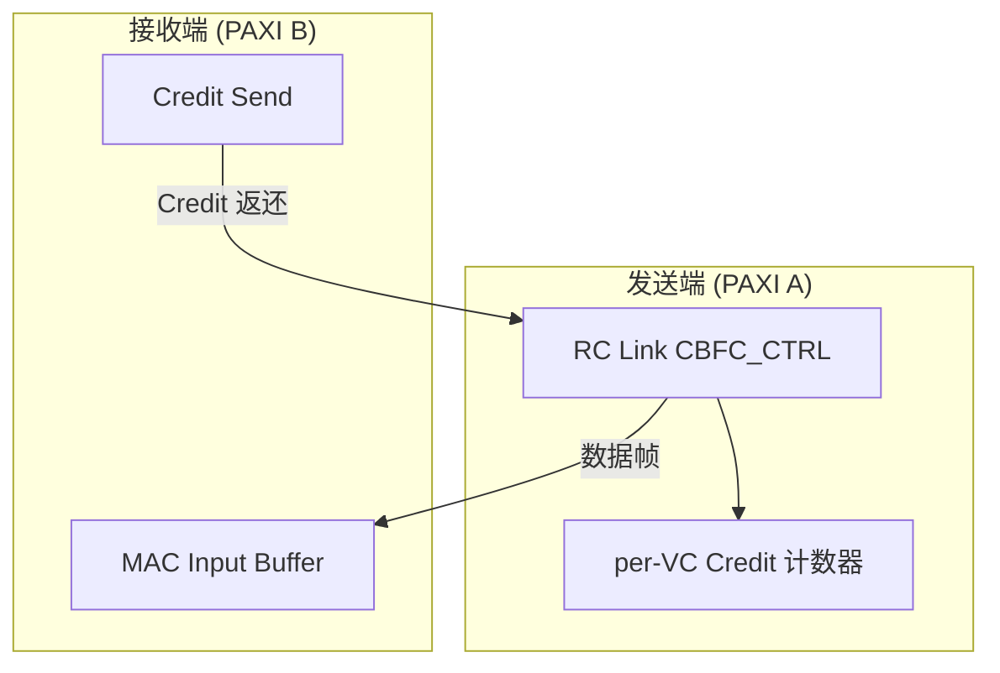
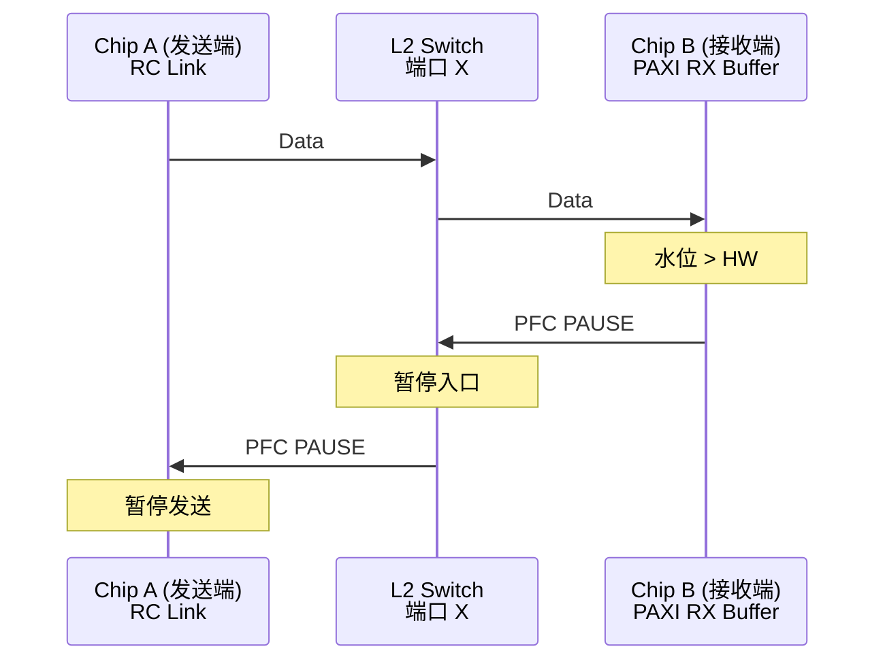
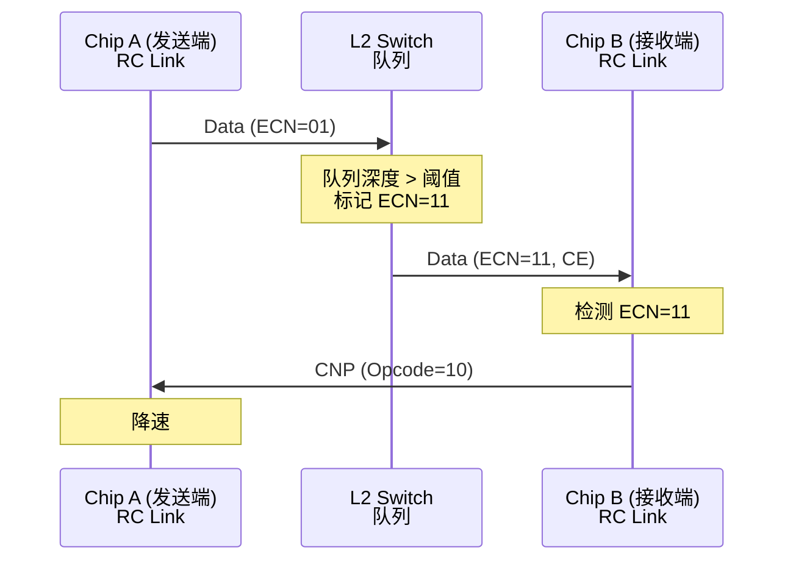
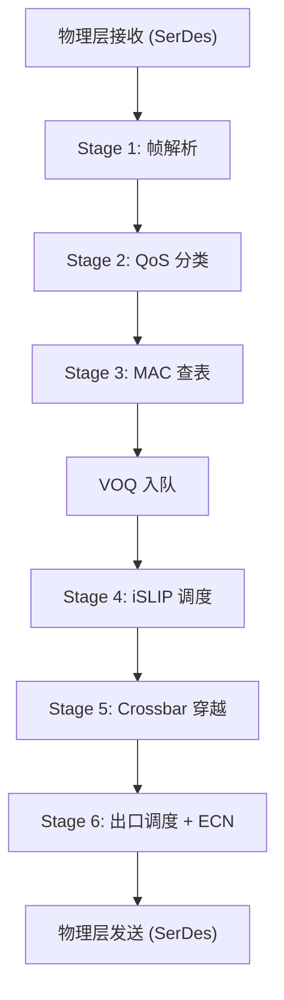
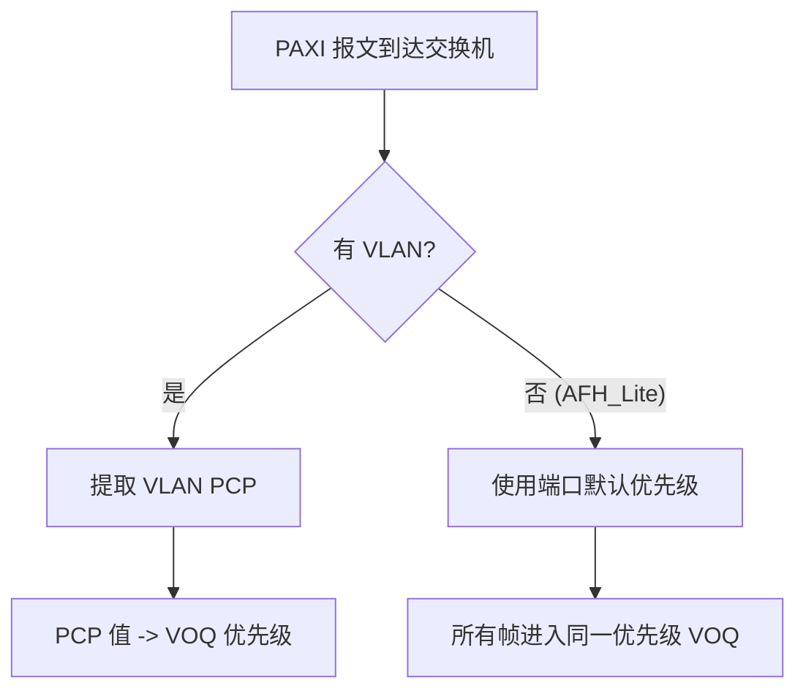
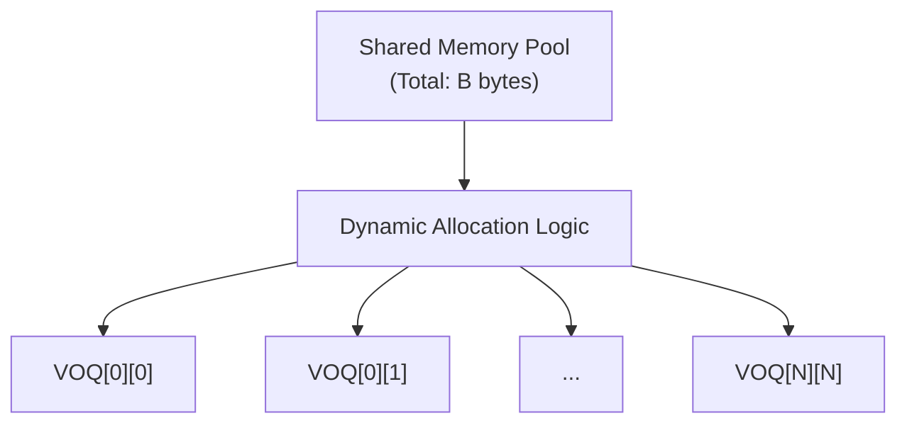
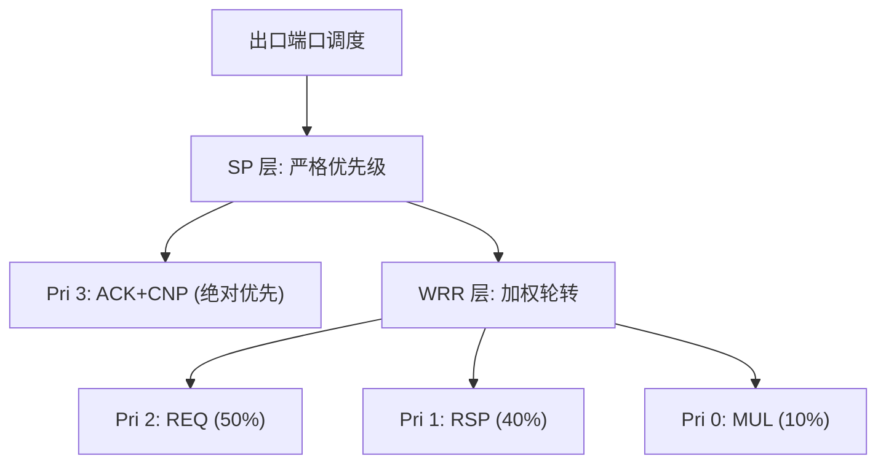
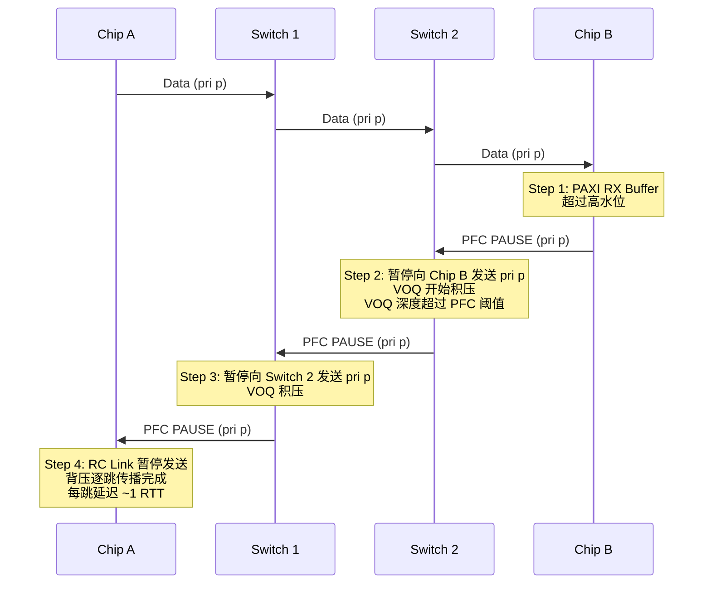

# 交换机行为建模分析

> 本文档分析 PAXI/RC Link 报文经过 L2 交换机时的行为, 从仿真建模角度梳理交换机需要处理的报文特征、内部处理流水线、调度仲裁、流控交互、QoS 映射和延迟模型。
>
> 基于: PAXI SUE2.0 Core UserGuide V2R0P5, RCLINK AFH SPEC v2.4

**标注约定:**
- **[DOC]** - 直接引用自官方文档原文
- **[推导]** - 基于文档信息的合理推导
- **[建模]** - 仿真建模需要关注的要点

---

## 1. 交换机兼容性声明

### 1.1 官方声明

**[DOC]** 来自 PAXI SUE2.0 UserGuide 1.2.1 General Features:

> "Compatible with Layer 2 switches."

PAXI 明确声称兼容二层交换机。这意味着交换机不需要理解 PAXI/RC Link 的传输层语义, 只需作为标准以太网帧的转发设备。

### 1.2 兼容性的本质

**[推导]** PAXI 报文对交换机而言是标准以太网帧:

- 所有 4 种报文格式 (Standard, AFH_GEN1, AFH_GEN2_16b, AFH_Lite) 均封装在标准以太网帧内
- 交换机基于 MAC DA 进行转发, 无需解析 IP/UDP 或 RH 层
- 交换机看到的只是不同长度的以太网帧, 携带不同的 EtherType/VLAN 标签

**[建模]** 交换机模型不需要解析 PAXI Flit/RH 的内容, 只需要处理以太网帧级别的行为:
- 帧长度 (决定串行化延迟和缓冲消耗)
- MAC DA (决定转发端口)
- VLAN PCP / Traffic Class (决定优先级队列)
- ECN 标记 (仅 Standard 格式)

---

## 2. 报文格式与交换机可见性

### 2.1 四种格式对交换机的呈现

**[DOC]** RC Link 支持四种报文格式, 交换机对不同格式的可见字段不同:

| 格式 | MAC 头 | 有 IP/UDP | 有 VLAN | 有 Eth_type | 交换机可解析层 |
|------|--------|----------|--------|------------|-------------|
| **Standard** | 标准 48b DA/SA | 有 | 可选 | 有 | MAC + VLAN + IP (含 ECN/DSCP) |
| **AFH_GEN1** | 自定义 12B AFH1 | 无 | 可选 | 有 | MAC DA/SA + VLAN + TC 域 |
| **AFH_GEN2_16b** | 自定义 12B AFH2 | 无 | 可选 | 有 | MAC DA/SA + VLAN + TC 域 |
| **AFH_Lite** | AFH_GEN2 复用 | 无 | 无 | 无 | 仅 MAC DA/SA |

### 2.2 各格式报文头开销

**[DOC]** 来自 RCLINK AFH SPEC 5.2, 各格式的报文头长度 (TYPE1 REQ):

| 格式 | 无 VLAN | 有 VLAN | 说明 |
|------|---------|--------|------|
| Standard | 12B MAC + 2B Eth_type + 20B IP + 8B UDP + 8B RH = **50B** | +4B VLAN = **54B** | 最大, 含完整协议栈 |
| AFH_GEN1 | 12B AFH1 + 2B Eth_type + 8B RH = **22B** | +4B VLAN = **26B** | 可选 TC 域 |
| AFH_GEN2_16b | 12B AFH2 + 2B Eth_type + 8B RH = **22B** | +4B VLAN = **26B** | 16-bit 地址压缩 |
| AFH_Lite | **12B** AFH2 头 (无 Eth_type/RH) | 不支持 VLAN | 最小, LITE 模式专用 |

**[建模]** 报文总长 = 报文头 + Payload (max 1344B) + 可选 ICRC (4B) + FCS (4B):
- Standard 无 VLAN: 50 + 1344 + 4 + 4 = **1402B** (最大)
- AFH_Lite: 12 + 1344 + 4 = **1360B** (最小, 无 ICRC)
- 均远小于 Jumbo Frame (9000B), 交换机不需要 Jumbo Frame 支持

### 2.3 各格式对交换机的行为影响

**[建模]** 从行为建模角度, 四种格式的核心差异在于交换机可执行的操作:

| 格式 | 转发 | QoS 分类 | ECN 标记 | 拥塞管理手段 |
|------|------|---------|---------|------------|
| **Standard** | MAC DA | VLAN PCP 或 DSCP | 支持 (有 IP 头) | ECN + PFC + CBFC |
| **AFH_GEN1/GEN2** | MAC DA | VLAN PCP (可选) | 不支持 (无 IP 头) | PFC + CBFC + Tail Drop |
| **AFH_Lite** | MAC DA | 仅端口默认优先级 | 不支持 | PFC + CBFC + Tail Drop |

**[建模]** 各格式的关键行为特征:

- **Standard**: 最完整的交换机交互能力, 交换机可进行 ECN 标记和基于 DSCP 的 QoS 分类
- **AFH_GEN1/GEN2**: 交换机 ECN 机制失效, 只能依赖 PFC/CBFC/Tail Drop 进行拥塞管理
- **AFH_Lite**: 最简模式, 专为交换机网络设计
  - 无 E2E 重传 (Go-Back-N 关闭), 丢包不可恢复, 交换机必须确保无损转发
  - 无 VLAN, 所有报文落入默认优先级队列
  - 头部开销最小 (12B), 带宽效率最高

---

## 3. 流控机制与交换机交互

### 3.1 流控模式选择

CBFC 和 PFC 互斥, 同一时间只能启用一种:

| 流控模式 | 交换机参与度 | 适用拓扑 |
|---------|----------|---------|
| **CBFC** | 完全透明, 交换机不参与 | 点对点、简单交换网络 |
| **PFC** | 交换机主动参与, 收发 PFC 帧 | 多跳交换网络 |

### 3.2 CBFC 模式 -- 对交换机透明

**[DOC]** CBFC 是端到端的 Credit-Based Flow Control:



**[推导]** 交换机在 CBFC 模式下的行为:

1. **完全透明**: CBFC 的 Credit 信息通过 MAC 层信号传递 (MAC2TX_CBFC_VLD_I), 不在以太网帧中显式编码。交换机只是转发普通以太网帧, 不参与流控
2. **无背压传播**: CBFC 不会产生 PFC 帧, 交换机端口不会被 PFC 暂停
3. **拥塞风险**: 如果交换机出口拥塞, 没有逐跳背压机制, 可能导致交换机丢包
4. **适用场景**: 点对点直连或低拥塞网络

**[建模]** CBFC 模式下交换机建模简化:
- 交换机不需要实现 PFC 状态机
- 需要关注交换机内部缓冲管理 (Tail Drop 或 WRED)
- CBFC 的 Credit 延迟 = 数据帧穿越交换机延迟 + Credit 返回延迟

### 3.3 PFC 模式 -- 交换机主动参与

**[DOC]** PFC 基于 PAXI RX Buffer 水位线触发:

```
PAXI RX Buffer 使用率:
  0% --------- LOW_WM --------- HIGH_WM --------- 100%
  |             |                  |                 |
  正常          解除PFC             触发PFC            缓冲溢出
```

**[DOC]** 来自 SUE2.0 3.2.23~3.2.25, 水位线配置:

| Buffer 类型 | 高水位线 (触发 PFC) | 低水位线 (解除 PFC) | 预留空间 |
|-----------|-----------------|-----------------|---------|
| REQ MEM | 32帧 + 1RTT | 1RTT | 1RTT (吸收在途数据) |
| RSP MEM | 32帧 + 1RTT | 1RTT | 1RTT |
| MUL MEM | 8帧 + 1RTT | 1RTT | 1RTT |

**[推导]** PFC 帧从 PAXI 端点发出, 经交换机到达发送端:



**[建模]** PFC 模式下交换机行为:

1. **交换机接收 PFC 帧**: 从下游端口收到 PFC PAUSE 帧后, 暂停对应优先级的上游端口发送
2. **交换机生成 PFC 帧**: 交换机自身出口拥塞时, 也可以向上游发送 PFC 帧 (如果交换机支持)
3. **逐跳传播**: PFC 可以在多跳网络中逐跳传播背压
4. **PFC 优先级映射**: VLAN PCP -> 交换机 QoS 优先级 -> PFC 通道

### 3.4 PFC 优先级映射

**[DOC]** 来自 RCLINK AFH SPEC 5.2.4:

> VLAN_TAG 中的 pri 字段 (3-bit) 映射到 CBFC/PFC 优先级。

**[DOC]** CBFC 模式下 VLAN pri 映射:

| VLAN pri | CBFC VC |
|----------|---------|
| pri[2:0] | 直接映射 VC[2:0] |

**[推导]** PFC 模式下, VLAN PCP 与 PAXI VC 的映射关系:

| PAXI 流量类型 | 建议 VLAN PCP | 对应交换机优先级队列 |
|-----------|-------------|-----------------|
| TYPE1 REQ Bank0~3 | PCP 3~4 | 高优先级 (数据流) |
| TYPE1 ACK + CNP | PCP 5~6 | 较高优先级 (控制流) |
| TYPE2 (多播) | PCP 2 | 中等优先级 |
| TYPE3 (原始以太网) | PCP 0 | Best-Effort |

**[建模]** 交换机需要为每个 PFC 优先级维护独立的入口/出口队列:
- 收到 PFC PAUSE 帧时, 仅暂停对应优先级的流量
- 其他优先级的流量不受影响
- 最多需要 8 个独立的优先级队列 (对应 8 个 VC)

### 3.5 ECN 与拥塞通知

**[DOC]** 来自 RCLINK AFH SPEC 4.1 Features:

> "ECN: Support ECN."

**[DOC]** 来自 RCLINK AFH SPEC 5.2.2:

> IP ToS = {DSCP[5:0], ECN[1:0]}

ECN 工作流程:



**[DOC]** RC Link 检测到收到的数据包中 ECN 字段为 CE (Congestion Experienced, 11) 时:
- 自动生成 CNP (Congestion Notification Packet, RH Opcode=10)
- 发回给发送端

**[推导]** ECN 的格式限制:

| 报文格式 | ECN 支持 | 原因 |
|---------|---------|------|
| Standard | **支持** | 有 IP 头, 交换机可标记 ECN |
| AFH_GEN1 | **不支持** | 无 IP 头, 交换机无法标记 |
| AFH_GEN2_16b | **不支持** | 无 IP 头 |
| AFH_Lite | **不支持** | 无 IP 头, 无 VLAN |

**[建模]** 交换机 ECN 标记行为 (仅 Standard 格式):
1. 检查入队报文的 IP ECN 字段, 若 ECN = 01 或 10 (ECT), 表示端点支持 ECN
2. 当出口队列深度超过 ECN 阈值时, 将 ECN 字段改写为 11 (CE)
3. 继续转发报文 (不丢弃)
4. 报文到达接收端 RC Link 后, RC Link 检测 CE 标记并生成 CNP

---

## 4. PAXI 速率控制与交换机的关系

### 4.1 速率控制概述

**[建模]** 交换机模型中, PAXI 的速率控制和 CNP 处理都是端点行为:

- **Per-QP 速率控制**: 基于时间窗口 + 字节阈值的限速机制 (非标准 DCQCN), 交换机不需要实现
- **CNP MERGE**: 端点过滤短时间内重复的 CNP 报文, 防止过度降速, 对交换机透明
- **交换机职责**: 仅需实现 ECN 标记 (将拥塞信号传递给端点), 以及转发 CNP 报文
- **CNP 优先级**: CNP 与 ACK 共享 VC, 交换机应为其分配较高优先级

---

## 5. 交换机内部架构

### 5.1 处理流水线概览

**[建模]** 一个 PAXI 帧进入交换机后经历的完整处理阶段:



**[建模]** 各阶段对 PAXI 不同格式的处理差异:

| 阶段 | Standard | AFH_GEN1/GEN2 | AFH_Lite |
|------|----------|---------------|----------|
| 帧解析 | 提取 MAC + IP + UDP | 提取 AFH MAC + Eth_type | 仅提取 AFH MAC |
| QoS 分类 | VLAN PCP 或 DSCP | VLAN PCP (或 TC 域) | 默认优先级 |
| MAC 查表 | 标准 48-bit DA | AFH 头中的 DA 字段 | AFH 头中的 DA 字段 |
| ECN 标记 | 可修改 IP.ECN | 不可用 (无 IP) | 不可用 |

### 5.2 入口处理

#### 5.2.1 QoS 分类

**[建模]** PAXI 流量的优先级来源, 按优先级排列:

```
1. VLAN PCP (3-bit, 0~7):
     仅当 vlan_en=1 时可用
     交换机直接使用 PCP 值分类到对应优先级队列

2. IP DSCP (6-bit, Standard 格式):
     交换机可选择用 DSCP 替代 PCP 分类
     PAXI 的 DSCP 携带 VC 信息 (CBFC 模式下)

3. 端口默认优先级:
     无 VLAN 时 (如 AFH_Lite), 所有帧使用端口默认优先级
     所有 PAXI 帧落入同一队列, 无法区分 VC
```

### 5.3 VOQ 架构

#### 5.3.1 VOQ 基本结构

**[建模]** VOQ (Virtual Output Queuing) 消除 Head-of-Line 阻塞:

```
输入端口 0:
  +-- VOQ[0][0][pri=0] --> 到出口端口 0, 优先级 0
  +-- VOQ[0][0][pri=1] --> 到出口端口 0, 优先级 1
  +-- ...
  +-- VOQ[0][0][pri=P] --> 到出口端口 0, 优先级 P
  +-- VOQ[0][1][pri=0] --> 到出口端口 1, 优先级 0
  +-- ...
  +-- VOQ[0][N][pri=P] --> 到出口端口 N, 优先级 P

输入端口 1:
  +-- VOQ[1][0][pri=0] --> ...
  +-- ...

总 VOQ 数量 = N_input x N_output x N_priority
```

**[推导]** PAXI 场景下的 VOQ 规模:

| 交换机规格 | 端口数 | 优先级数 | VOQ 总数 | 说明 |
|----------|--------|---------|---------|------|
| 小型 ToR | 8 | 4 | 256 | 8 芯片直连 |
| 中型 ToR | 16 | 4 | 1024 | 16 芯片, 常见配置 |
| 大型 Spine | 32 | 8 | 8192 | Spine 层, 全优先级 |
| 超大型 | 64 | 8 | 32768 | 大规模组网 |

#### 5.3.2 PAXI 流量的 VOQ 映射

**[推导]** PAXI VC 到 VOQ 优先级的映射:



**[建模]** PAXI 流量特征对 VOQ 的影响:

1. **REQ 和 RSP 应映射到不同优先级**: 避免 REQ 拥塞阻塞 RSP 返回 (死锁风险)
2. **ACK/CNP 应使用较高优先级**: 确保控制帧不被数据帧阻塞
3. **TYPE2 多播可使用独立优先级**: 隔离多播和单播流量

建议的最小优先级分配:

| 优先级 | PAXI 流量 | 理由 |
|--------|---------|------|
| 3 (高) | TYPE1 ACK + CNP | 控制帧优先, 保证 E2E 重传和拥塞反馈的时效性 |
| 2 (中) | TYPE1 REQ (数据) | 主要数据流量 |
| 1 (低) | TYPE1 RSP (响应) | 响应数据, 单独隔离防止 REQ-RSP 死锁 |
| 0 (BE) | TYPE2 / TYPE3 | 多播和管理流量 |

### 5.4 iSLIP 调度算法

#### 5.4.1 算法原理

**[建模]** iSLIP (Iterative Round-Robin Matching) 是交换机 Crossbar 的核心调度算法:

```
每个时间槽 (time slot) 执行 1~4 次迭代:

Iteration k:

  Step 1: Request (请求)
    每个输入端口 i 检查所有非空 VOQ:
      if VOQ[i][j][p] 非空:
        向输出端口 j 发送请求 (携带优先级 p)

  Step 2: Grant (授权)
    每个输出端口 j 使用 Round-Robin 仲裁器:
      从 grant_ptr[j] 开始扫描所有请求
      选择第一个请求, 发出授权
      *仅当授权被接受时* 才更新 grant_ptr

  Step 3: Accept (接受)
    每个输入端口 i 使用 Round-Robin 仲裁器:
      如果收到多个授权, 选择一个接受
      更新 accept_ptr[i] = (j+1) mod N
```

#### 5.4.2 iSLIP 与 PAXI 流量的交互

**[推导]** iSLIP 对 PAXI 流量的调度特征:

```
吞吐量 vs 迭代次数:
  1 次迭代: ~63% 吞吐 (延迟最低)
  2 次迭代: ~99% 吞吐 (推荐)
  4 次迭代: ~99.9% 吞吐 (高吞吐优先)
```

**[建模]** PAXI 场景下的 iSLIP 考量:

1. **小帧高频**: PAXI 最大帧 ~1406B, 远小于 9000B Jumbo Frame。相同数据量下调度决策次数更多, iSLIP 迭代开销占比更大
2. **多优先级**: 若使用优先级感知的 iSLIP 变体, 高优先级 VOQ (ACK/CNP) 的 Grant 应优先
3. **Incast 模式**: 集合通信 (AllReduce) 场景下多个输入端口同时向一个输出端口发送, iSLIP 的 Round-Robin 特性可保证公平性
4. **指针去同步化**: iSLIP 的核心优势 -- Grant 指针仅在被接受时更新, 逐渐去同步, 减少碰撞

#### 5.4.3 优先级感知调度

**[建模]** 在 iSLIP 基础上增加优先级处理:

```
方案 A: 严格优先级 + iSLIP
  - 高优先级 VOQ 有数据时, 始终优先调度
  - 同优先级内使用 iSLIP 仲裁
  - 风险: 低优先级可能饥饿

方案 B: 加权 iSLIP
  - 按优先级权重分配调度机会
  - 例如: ACK/CNP 权重 4, REQ 权重 2, RSP 权重 2, BE 权重 1
  - 避免饥饿, 但高优先级延迟略增

推荐: 方案 A (PAXI ACK/CNP 流量占比小, 饥饿风险低)
```

### 5.5 共享缓冲池与 DT 算法

#### 5.5.1 共享缓冲架构

**[建模]** 交换机使用共享内存池, 所有 VOQ 动态共享:



#### 5.5.2 DT (Dynamic Threshold) 算法

**[建模]** DT 算法控制每个 VOQ 的最大可用缓冲:

```
对于 VOQ[i][j][p]:

  Static_Reserved = S                    # 保底缓冲 (如 128 KB/VOQ)
  Shared_Available = B - sum(all_used)   # 全局剩余共享缓冲
  Dynamic_Quota = alpha * Shared_Available
  Max_Allowed = Static_Reserved + Dynamic_Quota

入队判断:
  if VOQ[i][j][p].used < Max_Allowed:
    允许入队
  else:
    丢弃 (Tail Drop) 或触发 PFC (若启用)
```

**[推导]** alpha 参数对 PAXI 流量的影响:

| alpha 值 | 行为 | 适用场景 |
|---------|------|---------|
| alpha < 1 | 保守: 限制单个 VOQ 占用, 保护其他 VOQ | 多流量均衡场景 |
| alpha = 1 | 均衡: 平均分配剩余缓冲 | 默认推荐 |
| alpha = 2 | 激进: 允许单个 VOQ 占用更多缓冲 | Incast 突发吸收 |
| alpha = 4~8 | 深吸收: 最大化突发吸收能力 | AllReduce 同步突发 |

**[建模]** PAXI 场景的 DT 参数建议:

```
集合通信 (AllReduce/AllToAll) 场景:
  - Incast 严重, 多输入同时涌向一个输出
  - 建议 alpha >= 2, 允许热点 VOQ 临时占用更多缓冲
  - Static_Reserved 保持较小 (128-256 KB), 最大化共享池

点对点 (P2P) 通信场景:
  - 流量较均匀, 无严重 Incast
  - alpha = 1 即可
  - Static_Reserved 可适当增大
```

#### 5.5.3 缓冲需求估算

**[建模]** 基于 PAXI 流量特征的缓冲需求:

```
Incast 突发吸收:
  N 个输入端口 x BW 同时发往 1 个输出端口
  突发持续时间 T_burst

  需要缓冲 = (N - 1) x BW x T_burst

示例 (8 端口 x 200GbE, 突发 10 us):
  Buffer = (8-1) x 200 Gbps x 10 us = 1.75 MB (单个出口端口)

全交换机缓冲:
  典型: 16 ~ 64 MB (取决于端口数和突发容忍度)
```

**[推导]** PAXI 报文较短 (max 1406B vs 9000B Jumbo):
- 单帧占用缓冲少, 但报文数量多
- 相同数据量下, 调度器压力更大 (更多调度决策)
- 缓冲管理粒度更细 (更多小条目)

### 5.6 出口 QoS 调度

#### 5.6.1 调度算法选择

**[建模]** 出口端口从多个优先级队列中选择下一个发送的帧:

| 算法 | 行为 | PAXI 适用性 |
|------|------|-----------|
| **Strict Priority (SP)** | 高优先级绝对优先, 低优先级可能饥饿 | 推荐: ACK/CNP 流量少, 不会造成饥饿 |
| **WRR (Weighted Round Robin)** | 按权重轮转, 避免饥饿 | 可选: 需要带宽保证时 |
| **DWRR (Deficit WRR)** | WRR + 帧大小补偿, 更公平 | 可选: PAXI 帧大小较一致, WRR 即可 |

#### 5.6.2 推荐的 PAXI 出口调度

**[建模]** 两层混合调度:



**[推导]** 这种设计的原因:
- ACK/CNP 用 SP: 帧体积小 (26~54B), 流量占比 <5%, 不会饥饿其他队列, 但保证控制帧最低延迟
- REQ/RSP 用 WRR: 防止 REQ 独占带宽导致 RSP 返回受阻 (可能引起上游 PAXI RX Buffer 溢出)
- RSP 权重略低于 REQ: 写响应 (B Flit) 和读数据 (R Flit) 通常滞后于请求

### 5.7 PFC 内部状态机

#### 5.7.1 交换机 PFC 接收行为

**[建模]** 交换机从下游收到 PFC PAUSE 帧后:

- 按 per-priority 暂停对应优先级的出口发送, 其他优先级不受影响
- 暂停有定时器控制, 超时后自动恢复
- 下游可发送新的 PFC 帧续期或提前解除

#### 5.7.2 交换机 PFC 发送行为

**[建模]** 交换机自身出口拥塞时:

- 周期性检查各 (output_port, priority) 的 VOQ 队列深度
- 队列深度超过 xon 阈值: 向上游入口端口发送 PFC PAUSE
- 队列深度降到 xoff 阈值以下: 发送 RESUME 或等待 PAUSE 超时自动恢复

#### 5.7.3 PFC 逐跳传播

**[推导]** 多跳网络中 PFC 的传播行为:



**[建模]** PFC 风险 -- 死锁与风暴:

| 风险 | 原因 | 缓解措施 |
|------|------|---------|
| **PFC 死锁** | 环形拓扑中 PFC 形成循环依赖 | 避免环路拓扑; PFC Watchdog 超时恢复 |
| **PFC 风暴** | 单点触发的 PAUSE 雪崩传播 | 限制传播深度; 用 ECN 主动避拥塞 |
| **Victim Flow** | 无关流量被同优先级 PFC 误暂停 | REQ/RSP 分优先级; 避免共享优先级 |

### 5.8 ECN 标记逻辑

**[建模]** 交换机 ECN 标记的内部实现 (仅 Standard 格式有效):

```
帧出队时 (即将发送到出口端口):
  |
  检查帧的 IP ECN 字段:
    if ECN == 00 (Not-ECT): 不支持 ECN, 跳过
    if ECN == 01 或 10 (ECT): 端点支持 ECN
      |
      检查出口队列深度 Q:
        if Q < ecn_threshold_low:
          不标记 (正常)
        if ecn_threshold_low <= Q < ecn_threshold_high:
          概率标记: P_mark = (Q - low) / (high - low)
          以概率 P_mark 将 ECN 改写为 11 (CE)
        if Q >= ecn_threshold_high:
          确定标记: ECN = 11 (CE)
    if ECN == 11 (CE): 已被上游标记, 保持不变
```

**[推导]** ECN 阈值与 PFC 阈值的关系:

```
队列深度:
  0% ---- ecn_low ---- ecn_high ---- pfc_xon ---- pfc_xoff ---- 100%
  |         |             |             |             |            |
  正常    ECN概率标记    ECN全标记     PFC触发       PFC持续      溢出

典型配置:
  ecn_low  = 30~50% 队列深度
  ecn_high = 70~80% 队列深度
  pfc_xon  = 80~85% 队列深度
  pfc_xoff = 60~70% 队列深度 (解除 PFC 的阈值, 低于 pfc_xon)

设计目标: ECN 应在 PFC 之前生效, 通过端到端降速避免触发逐跳 PFC
```

---

## 6. 交换机延迟模型

### 6.1 端到端延迟分解

**[建模]** 加入交换机后的完整路径延迟:

```
T_total = T_paxi_tx + T_rclink_tx + T_cesoc_tx
        + T_link_1 + T_switch + T_link_2
        + T_cesoc_rx + T_rclink_rx + T_paxi_rx
```

### 6.2 交换机延迟组成

```
T_switch = T_ingress + T_queueing + T_crossbar + T_egress

其中各阶段对应第 5.1 节流水线:
  T_ingress  = Stage 1~3 (解析 + 分类 + 查表)
  T_queueing = VOQ 排队等待 (iSLIP 调度延迟)
  T_crossbar = Stage 5 (Crossbar 穿越)
  T_egress   = Stage 6 (出口调度 + 串行化)
```

| 延迟组件 | 含义 | 典型值 |
|---------|------|--------|
| T_ingress | 解析 + 分类 + 查表 (固定流水线) | 50-200 ns |
| T_queueing | VOQ 排队 (iSLIP 调度 + 出口竞争) | 0 ~ 数 us (负载相关) |
| T_crossbar | Crossbar 穿越 | 10-50 ns |
| T_egress | 出口调度 + 串行化 | 帧大小相关 |

### 6.3 串行化延迟

**[建模]** PAXI 报文的串行化延迟:

| 报文场景 | 帧大小 | 100GbE | 200GbE | 400GbE |
|---------|--------|--------|--------|--------|
| TYPE1 REQ 最大帧 (Standard+VLAN) | ~1406B | 112.5 ns | 56.2 ns | 28.1 ns |
| TYPE1 REQ 最大帧 (AFH_Lite) | ~1360B | 108.8 ns | 54.4 ns | 27.2 ns |
| TYPE1 ACK (Standard+VLAN) | ~54B | 4.3 ns | 2.2 ns | 1.1 ns |
| TYPE1 ACK (AFH_GEN1) | ~26B | 2.1 ns | 1.0 ns | 0.5 ns |

**[推导]** 与标准 RoCE v2 的对比:
- RoCE v2 + MTU 4096B: 串行化延迟 ~328 ns (100GbE)
- PAXI Standard 最大帧 1406B: 串行化延迟 ~112 ns (100GbE)
- PAXI 报文更短, 串行化延迟更低, 但同等数据量需要更多报文、更多调度决策

### 6.4 转发模式

| 转发模式 | 延迟 | 适用性 |
|---------|------|--------|
| **Cut-Through** | 固定 ~300-500 ns (与帧大小无关) | 推荐: 入口/出口速率相同时 |
| **Store-and-Forward** | T_serialization + T_processing (帧大小相关) | 速率不匹配或需 CRC 校验时 |

**[推导]** Cut-Through 在出口拥塞时退化为 Store-and-Forward: 当出口端口正在发送其他帧时, 新帧无法立即直通, 必须完整缓存后排队等待。

### 6.5 排队延迟估算

**[建模]** 使用 M/D/1 排队论模型近似 (PAXI 帧长较固定):

```
M/D/1 模型 (泊松到达, 固定服务时间):

  rho = lambda / mu               (利用率, 必须 < 1)
  lambda = 到达速率 (帧/秒)
  mu = 服务速率 = BW / frame_size  (帧/秒)

  平均等待时间: W = (1/mu) * rho / (2 * (1 - rho))
  平均队列长度: L = rho^2 / (2 * (1 - rho))

示例 (200GbE, 帧大小 1406B, 利用率 80%):
  mu = 200e9 / (1406*8) = 17.78 M帧/秒
  rho = 0.8
  W = (56.2 ns) * 0.8 / (2 * 0.2) = 112.4 ns
  L = 0.64 / 0.4 = 1.6 帧
```

**[推导]** 实际排队延迟受 Incast 等突发模式影响, 远高于 M/D/1 近似。建模时应使用事件驱动仿真而非排队论公式。

### 6.6 多跳延迟模型

**[建模]** N 跳交换网络:

```
T_network = sum_{i=1}^{N} (T_link_i + T_switch_i)

Cut-Through 简化:
  T_network ~= N * (T_propagation + T_switch_fixed)
             + T_serialization (仅最后一跳)
             + sum_{i=1}^{N} T_queueing_i
```

---

## 7. 两种典型组网场景

### 7.1 场景 A: 点对点直连 (无交换机)


流控: CBFC (推荐) 或 PFC
格式: AFH_GEN1/AFH_GEN2_16b (低头开销)
重传: Go-Back-N (TYPE1)

**[建模]** 无交换机时:
- T_switch = 0
- 延迟 = T_paxi_tx + T_rclink_tx + T_cesoc_tx + T_link + T_cesoc_rx + T_rclink_rx + T_paxi_rx
- CBFC 的 RTT = 上述延迟 * 2

### 7.2 场景 B: 交换机组网 (LITE 模式)


流控: PFC (交换机参与) 或 CBFC (透明穿越)
格式: AFH_Lite (最低头开销) 或 Standard (需要 ECN)
重传: 无 (LITE 模式关闭 Go-Back-N)

**[推导]** LITE 模式下交换机网络的关键约束:

1. **无损要求**: 没有 E2E 重传, 任何丢包都不可恢复
   - 交换机必须配置 PFC 或足够深的缓冲
   - 建议使用 PFC 模式 (CBFC_EN=0) 配合 Standard 格式 (提供 ECN 支持)

2. **延迟增加**: 每个交换机增加 300ns ~ 数 us 延迟
   - CBFC 的 Credit 往返时间增加
   - 可能需要增大 credit_limit 以维持吞吐

3. **带宽效率**: AFH_Lite 头部仅 12B, 报文效率最高
   - 有效带宽利用率: 1344 / (1344 + 12 + 4) = 98.8%
   - Standard 格式: 1344 / (1344 + 54 + 4 + 4) = 95.6%

### 7.3 场景 C: 交换机组网 (Standard 格式, 全功能)


流控: PFC (逐跳背压) + ECN (端到端拥塞通知)
格式: Standard (含 IP/UDP, 支持 ECN)
重传: Go-Back-N (TYPE1, E2E 保护)

**[推导]** 最接近标准 RoCE v2 网络的方案:

- 交换机可以同时使用 ECN 和 PFC
- ECN 提供主动拥塞避免, PFC 提供最后一道防线
- Go-Back-N 重传提供端到端可靠性
- 代价: 报文头较大 (50-54B), 有效带宽利用率降低

---

## 8. 建模参数汇总

### 8.1 交换机模型输入参数

| 参数 | 说明 | 典型值 |
|------|------|--------|
| `port_count` | 端口数量 | 4 / 8 / 16 / 32 / 64 |
| `port_bandwidth_gbps` | 端口带宽 | 100 / 200 / 400 |
| `forwarding_mode` | 转发模式 | Cut-Through / Store-and-Forward |
| `buffer_size_mb` | 总缓冲大小 | 16 / 32 / 64 |
| `buffer_sharing` | 缓冲共享策略 | Static / Dynamic Threshold (DT) |
| `dt_alpha` | DT 算法 alpha 参数 | 0.5 / 1.0 / 2.0 |
| `ecn_enabled` | 是否启用 ECN 标记 | true/false (仅 Standard 格式有效) |
| `ecn_threshold_low` | ECN 标记起始阈值 | 50% 队列深度 |
| `ecn_threshold_high` | ECN 全标记阈值 | 80% 队列深度 |
| `pfc_enabled` | 是否启用 PFC | true/false |
| `pfc_threshold` | PFC 触发阈值 | 85% 队列深度 |
| `num_priorities` | QoS 优先级数量 | 4 / 8 |
| `fixed_latency_ns` | 固定处理延迟 | 300 / 500 / 800 |

### 8.2 PAXI 端点参数 (影响交换机行为)

| 参数 | 说明 | 来源 |
|------|------|------|
| `pkt_format` | 报文格式 | Standard / AFH_GEN1 / AFH_GEN2 / AFH_Lite |
| `max_frame_size` | 最大帧长 | 1344B Payload + 头部开销 (格式相关) |
| `flow_control_mode` | 流控模式 | CBFC 或 PFC (互斥) |
| `lite_mode` | LITE 模式 | 是否启用 LITE (无重传) |
| `vlan_enabled` | VLAN 使能 | 是否插入 VLAN 标签 |
| `ecn_capable` | ECN 能力 | 仅 Standard 格式下有效 |
| `num_vc` | VC 数量 | 8 |
| `vc_pcp_mapping` | VC 到 PCP 映射 | VC 与 VLAN 优先级的对应关系 |

### 8.3 建模约束

| 约束 | 说明 |
|------|------|
| 帧长 < 1500B | PAXI 最大帧 ~1406B, 不需要 Jumbo Frame |
| LITE 模式无重传 | 丢包 = 数据丢失, 交换机必须无损 |
| ECN 仅限 Standard | AFH 格式下无 ECN, 只能靠 PFC/CBFC |
| CBFC 对交换机透明 | 交换机无需实现 CBFC 逻辑 |
| PFC 逐跳传播 | 交换机需要实现 per-priority PFC |
| VLAN PCP 映射 VC | 交换机按 PCP 分优先级队列 |

---

## 9. 与通用交换机建模的差异总结

| 维度 | 通用交换机 (RoCE v2) | PAXI 交换机 |
|------|---------------------|------------|
| **帧大小** | 64B ~ 9000B (Jumbo) | 64B ~ 1406B (无 Jumbo) |
| **协议栈** | 标准 Eth/IP/UDP/BTH | 4 种格式, 仅 Standard 有 IP/UDP |
| **ECN** | 始终可用 (有 IP 头) | 仅 Standard 格式可用 |
| **流控** | PFC + DCQCN | PFC 或 CBFC (互斥), 速率控制非 DCQCN |
| **拥塞控制** | DCQCN (标准算法) | Per-QP 时间窗口限速 |
| **Payload** | 最大 4096B (MTU) | 最大 1344B (TYPE1_PKT_LEN) |
| **重传** | Go-Back-N (RDMA) | TYPE1 支持, LITE 模式关闭 |
| **QoS 映射** | DSCP / VLAN PCP | VLAN PCP + Traffic Class |
| **组网模式** | 多跳标准以太网 | 直连 / 交换机 (LITE) / 标准 (Standard) |
